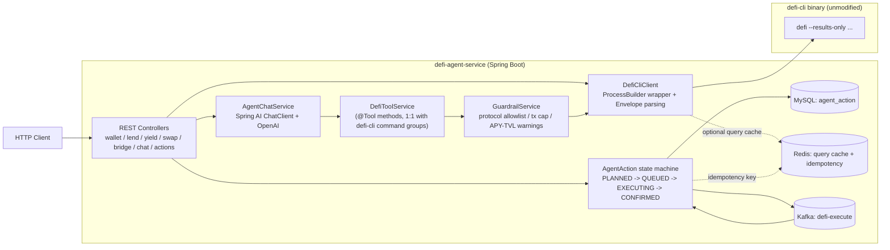

# defi-agent-service

Java (Spring Boot) backend for the DeFi AI Agent. Natural language → AI tool-calling
orchestration → real on-chain data via the Go `defi-cli` binary → an async, MySQL/Redis/Kafka-backed
execution state machine.

## Features

- **Unified REST API** for DeFi asset/lending/yield/swap/bridge queries (`/api/v1/*`), all backed
  by real data fetched through the Go `defi-cli` binary (no private keys required for reads).
- **AI agent orchestration** (`/api/chat`): Spring AI + OpenAI tool-calling translates natural
  language into structured `defi-cli` calls (`com.defiagent.ai.DefiToolService`), with a
  dependency-free rule-based fallback (`com.defiagent.service.AgentService`) when no
  `OPENAI_API_KEY` is configured.
- **Execution state machine** (`com.defiagent.domain.AgentAction`): `PLANNED → QUEUED → EXECUTING →
  CONFIRMED/FAILED/CANCELLED`, persisted in MySQL, driven asynchronously via Kafka, with
  Redis-backed idempotency and query caching.
- **Guardrails** (`com.defiagent.guardrails`): protocol allowlist, per-transaction USD cap, and
  APY/TVL risk warnings — evaluated before any plan is created.

## Architecture



## Architecture & Boundaries — what's real vs. simulated

This is the section most worth reading before a technical deep-dive or interview follow-up:

| Step | Data source | Real or simulated? |
|---|---|---|
| Wallet balance / lend markets / rates / positions / yield opportunities / swap & bridge quotes (`/api/v1/*`, and the equivalent `DefiToolService` tools) | Real `defi-cli` subprocess call, hitting live RPC/protocol/aggregator APIs | **Real** |
| `plan` (`yield deposit plan`, `lend supply plan`) | Real `defi-cli` call. Returns a real `action_id` and real on-chain call `steps` (target, calldata, value) computed against live contract state | **Real** — a genuine, executable transaction plan |
| `estimate` (`GET /api/actions/{id}/estimate`, and inside `ExecutionService` right before broadcast) | Real `defi-cli` call: `eth_estimateGas` / `eth_simulateV1` / live base fee against the plan's RPC | **Real** |
| `submit` / broadcast | `ExecutionService.paperExecute` — `Thread.sleep` + a deterministic fake `0xdemo...` tx hash | **Simulated ("paper mode")** |

**Why this boundary?** `defi-cli`'s own `submit` commands sign and broadcast with a real private key
(local key, keystore, or an env var). This Java service **never invokes any `submit` command** and
**never handles a private key** — `com.defiagent.cli.DefiCliClient` only exposes read-only queries
plus `plan` / `show` / `estimate` methods. Broadcasting is entirely simulated in
`com.defiagent.service.ExecutionService`, guarded by the same Kafka + Redis idempotency machinery a
real broadcast path would need. This keeps the demo safe to run against real on-chain data without
ever risking real funds, while still exercising a realistic async execution pipeline.

If a chat turn didn't include a wallet address (or `defi-cli`/RPC is unavailable, or the provider
needs extra params like a Morpho vault address), the plan step gracefully degrades to a paper-only
plan with no `defiActionId` — `/estimate` then returns `409 Conflict` explaining why, instead of a
fake number.

## Running

### Prerequisites

- Java 17+, Maven
- MySQL, Redis, Kafka (see `docker-compose.yml`)
- The `defi-cli` binary built from [`../defi-cli`](../defi-cli):

  ```bash
  cd ../defi-cli && go build -o defi ./cmd/defi
  export DEFI_CLI_PATH=$(pwd)/defi
  ```

- (Optional) `OPENAI_API_KEY` for the Spring AI tool-calling agent. Without it, `/api/chat` falls
  back to the rule-based `AgentService` (still calls real `defi-cli` for its yield ranking, just
  without LLM-driven conversation).

### Start infrastructure + app

```bash
docker compose up -d
mvn spring-boot:run
```

### Key endpoints

- `GET /api/v1/wallet/balance?chain=ethereum&address=0x...`
- `GET /api/v1/lend/markets?provider=aave&chain=ethereum&asset=USDC`
- `GET /api/v1/yield/opportunities?chain=ethereum&asset=USDC`
- `GET /api/v1/swap/quote?provider=uniswap&chain=ethereum&fromAsset=USDC&toAsset=ETH&amount=1000000&fromAddress=0x...`
- `GET /api/v1/bridge/quote?provider=across&from=ethereum&to=base&asset=USDC&amount=1000000`
- `POST /api/chat` `{"sessionId": "s1", "message": "把 1000 USDC 存到以太坊收益最高的池"}`
- `GET /api/actions/{actionId}/estimate` — real gas/fee estimate for a plan's `defiActionId`
- Swagger UI: `http://localhost:8080/swagger-ui.html`

### Configuration

| Property | Env var | Default | Purpose |
|---|---|---|---|
| `defi.cli.path` | `DEFI_CLI_PATH` | `defi` (resolved via `PATH`) | Path to the built `defi-cli` binary |
| `defi.cli.timeout` | – | `10s` | Per-command subprocess timeout |
| `spring.ai.openai.api-key` | `OPENAI_API_KEY` | *(empty)* | Enables the Spring AI tool-calling agent |
| `agent.max-single-tx-usd` | `AGENT_MAX_SINGLE_TX_USD` | `10000` | Guardrail: max planned tx size |
| `agent.allowed-protocols` | `AGENT_ALLOWED_PROTOCOLS` | *(empty = all allowed)* | Guardrail: protocol allowlist |

## Tests

```bash
mvn test
```

- `DefiCliClientTest` — fake `CommandRunner`, verifies argument construction, Envelope parsing, and
  error-code mapping without a real `defi-cli` binary.
- `GuardrailServiceTest` — protocol allowlist / amount cap / APY-TVL warning logic.
- `DefiToolServiceTest` — verifies a blocked guardrail short-circuits before `DefiCliClient` is ever
  called.
